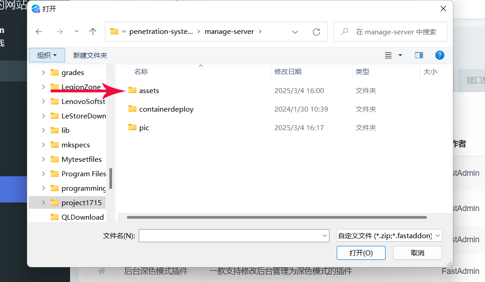
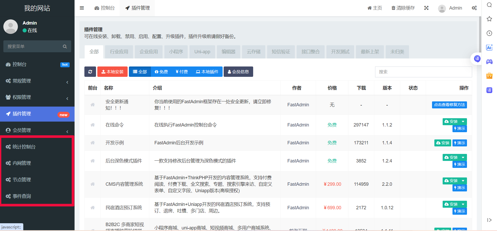

## 介绍
基于Thinkphp+Bootstrap框架的内网穿透集群管理系统+Docker容器化部署

## 需要知识

* HTML,CSS,Javascript
* PHP
* Thinkphp,Bootstrap
* Docker


## 项目启动
1. 下载docker镜像
   ```markdown
    #登录阿里云仓库，密码为1715wkspace
    docker login --username=1715wkspace registry.cn-heyuan.aliyuncs.com
    #下载镜像地址
    docker pull registry.cn-heyuan.aliyuncs.com/fast_deploy/ubuntu-20.04:1.0 
    ```
2. 创建并进入容器
   ```markdown
     #创建容器，hostport与容器内的80端口绑定；image_id为下载镜像id
     docker run -itd -p [hostport]:80 [image_id]
   ```
4. 开启服务    
   ```markdown
     #进入容器(container_id为创建的容器id)
     docker exec -it [container_id] /bin/bash
     #开启LAMP服务
     执行./start.sh
    ```
5. 设置数据库密码
   ```markdown
      #初始化数据密码
      执行./init.sh(执行完后不要马上退出此脚本，后面还要导入数据表)
   ```
6. 安装fastadmin
    ```markdown
      #IP为服务器的IP,hostport同第2步的hostport
      访问fastadmin安装面板：IP:hostport/install.php(MYSQL数据库名要记住，第6步要用到)
    ```
7. 导入数据表
   ```markdown
       #回到init.sh脚本，执行dump_mysql导入数表
       INPUT dbname for fastadmin: 第5步fastadmin安装面板中输入的MYSQL数据库名
       Enter password: mysql根用户密码
   ```
8. 修改apache和mysql的日志轮转周期
     ```markdown
     cd /etc/logrotate.d
     将apache2和mysql-server中rotate值改为小于3大于0的数
     ```
9. 安装内网穿透插件
   #### 进入后台管理面板
   
   #### 插件管理
   第一次安装需要注册fastadmin账号
   
   #### 安装插件
   
   全部安装即可
   
    